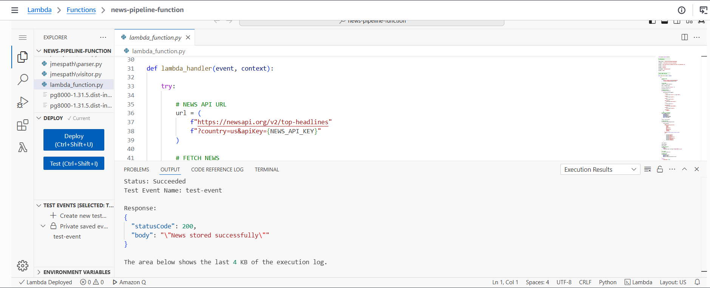
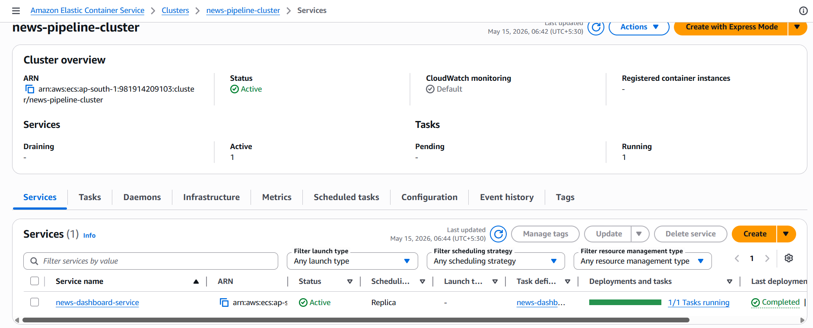
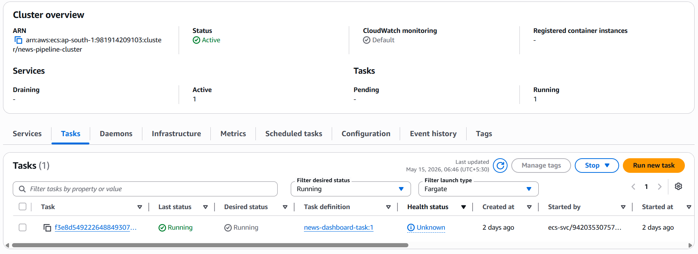
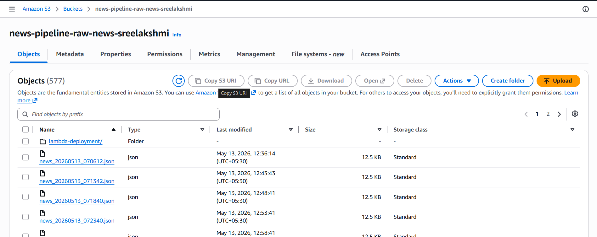
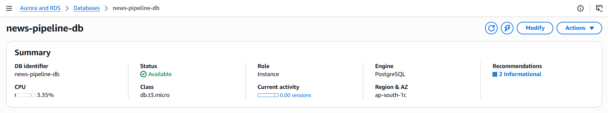

# News Pipeline on AWS

A cloud-based end-to-end news data pipeline built using AWS services, Python, Docker, PostgreSQL, and Streamlit.

This project automates the process of collecting real-time news articles from NewsAPI, storing raw data in Amazon S3, processing and saving structured records in PostgreSQL hosted on Amazon RDS, and visualizing the collected data through an interactive Streamlit dashboard deployed on Amazon ECS Fargate.

The project demonstrates practical implementation of:

- Serverless computing using AWS Lambda
- Cloud storage and database integration
- Docker containerization
- ECS Fargate deployment
- Real-world data engineering workflow
- Interactive dashboard development

---

# Architecture


---

# Project Workflow

The pipeline follows the workflow below:

1. AWS Lambda is triggered manually or on schedule.
2. Lambda fetches live news data from NewsAPI.
3. Raw JSON responses are uploaded to Amazon S3.
4. Structured article data is inserted into PostgreSQL hosted on Amazon RDS.
5. The Streamlit dashboard reads the stored data.
6. The dashboard is containerized using Docker.
7. The Docker image is deployed to Amazon ECS Fargate.

---

# Tech Stack

## Languages

- Python
- SQL

## AWS Services

- AWS Lambda
- Amazon S3
- Amazon RDS PostgreSQL
- Amazon ECS Fargate
- Amazon ECR
- Amazon CloudWatch

## Libraries & Frameworks

- Streamlit
- Pandas
- Requests
- Boto3
- pg8000

## DevOps Tools

- Docker
- Git
- GitHub

---

# Features

- Real-time news ingestion using NewsAPI
- Automated cloud-based processing pipeline
- Raw data storage in Amazon S3
- Structured relational storage using PostgreSQL
- Interactive analytics dashboard with Streamlit
- Docker-based containerization
- ECS Fargate deployment
- Fully cloud-hosted architecture

---

# AWS Services Used

| Service | Purpose |
|---|---|
| AWS Lambda | Fetch and process news articles |
| Amazon S3 | Store raw JSON news data |
| Amazon RDS PostgreSQL | Store processed article data |
| Amazon ECS Fargate | Deploy Streamlit dashboard |
| Amazon ECR | Store Docker images |
| Amazon CloudWatch | Monitor Lambda execution logs |

---

# Project Structure

```bash
news-pipeline/
│
├── dashboard/
│   ├── app.py
│   ├── Dockerfile
│   └── requirements.txt
│
├── lambda_function/
│   └── lambda_function.py
│
├── docs/
│   └── architecture.png
│
├── screenshots/
│   ├── lambda-success.png
│   ├── ecs-cluster.png
│   ├── ecs-task.png
│   ├── dashboard-home.png
│   ├── s3-bucket.png
│   └── rds-instance.png
│
├── requirements.txt
├── README.md
└── .gitignore
```

---

# Lambda Function

The Lambda function is responsible for the ingestion and processing layer of the pipeline.

### Operations Performed

- Fetches news articles from NewsAPI
- Processes article metadata
- Uploads raw JSON files to Amazon S3
- Inserts structured records into PostgreSQL
- Handles cloud-based execution without dedicated servers

### Runtime

- Python 3.12

---

# Database Design

The project uses PostgreSQL hosted on Amazon RDS.

## Table Structure

| Column | Description |
|---|---|
| source | News source name |
| author | Article author |
| title | News title |
| description | Short article summary |
| url | Original article URL |
| published_at | Publishing timestamp |
| content | Full article content |

---

# Docker Deployment

The Streamlit dashboard is containerized using Docker for portability and deployment.

## Build Docker Image

```bash
docker build -t news-dashboard .
```

## Run Docker Container

```bash
docker run -p 8501:8501 news-dashboard
```

---

# ECS Fargate Deployment

The Docker image is pushed to Amazon ECR and deployed using ECS Fargate.

### Deployment Components

- ECS Cluster
- ECS Service
- Task Definition
- Fargate Launch Type
- Public IP enabled networking

This enables the dashboard to run as a fully managed containerized cloud service.

---

# Screenshots

## AWS Lambda Execution



---

## ECS Cluster



---

## ECS Running Task



---

## Streamlit Dashboard


---

## Amazon S3 Storage



---

## Amazon RDS PostgreSQL



---

# Deployment Steps

## Lambda Deployment

1. Package Lambda dependencies
2. Upload deployment ZIP to AWS Lambda
3. Configure IAM permissions
4. Add environment variables
5. Test Lambda execution

## Dashboard Deployment

1. Build Docker image
2. Push image to Amazon ECR
3. Create ECS Cluster
4. Create Task Definition
5. Deploy ECS Service using Fargate


# Author

## Sreelakshmi TK

